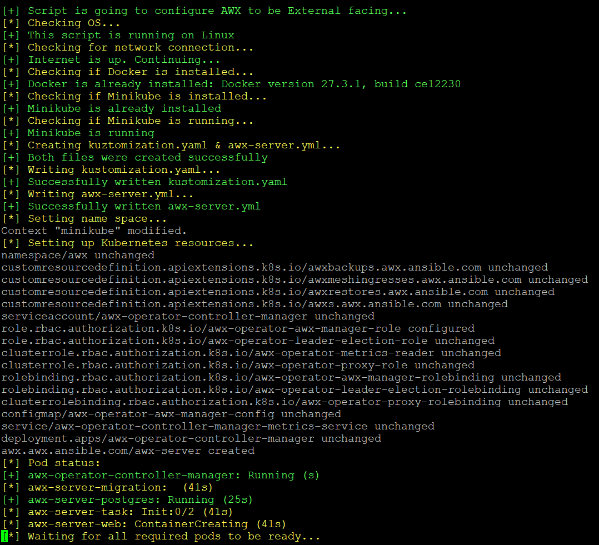

# Automated-AWX-Deployment

This repository provides an automated installation script for AWX, along with optional installations for Docker and Minikube. AWX is the open-source version of Ansible Tower, allowing you to manage and scale your Ansible automation.

For manual installation, do refer to my write up [here](https://time0ut07.github.io/projects.html#Documentation).

## Table of Contents

- [Prerequisites](#Prerequisites)
- [Installation](#Installation)

## Prerequisites

Before running the installation script, ensure you have the following:

- You are installing on a Linux System
- Git installed (optional)

## Installation

Clone the Repository 
```bash
git clone https://github.com/time0ut07/Automated-AWX-Deployment
```

Ensure `awx_install.sh` can be executed
```bash
chmod +x awx_install.sh
```

Execute `awx_install.sh`
```bash
./awx_install.sh <options>
```

|Options|Description|
|-------|-----------|
|-h|Display help manu|
|-int|Will host AWX internally|
|-ext|Will portforward AWX|



## Assessing AWX

After installation, the script will display your credentials and the IP address + port for you. You can access it by visiting on your browser.
